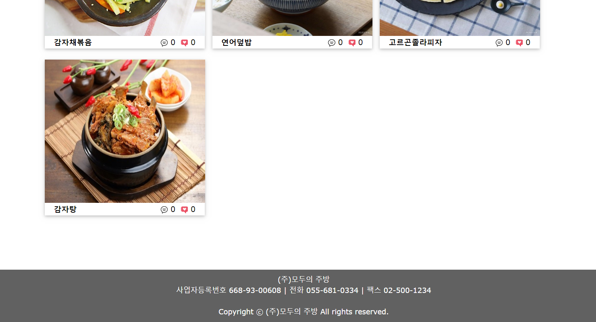
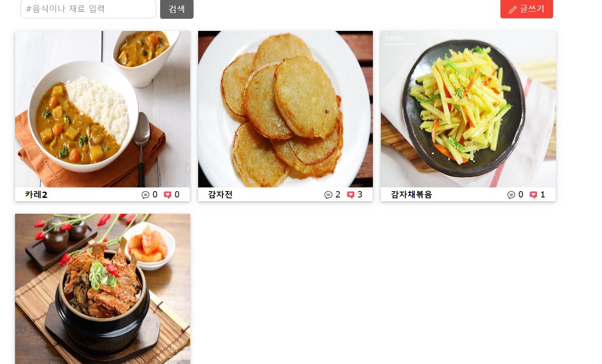

# 모두의 주방(Kitchen Of All)
 - 모두의 주방(SpringMVC + hibernate-validator + mybatis + oracleDB 를 이용한 레시피 공유 사이트)
 - 레시피 공유 사이트 , 해쉬 태그를 이용하여 가지고 있는 재료나 먹고 싶은 음식을 검색할 수 있다.
 
***
모두의 주방(Kitchen Of All) 구현 기능
-------------
-  로그인
-  회원가입(hibernate-validator를 이용한 유효성 검증)
-  사진 형식의 게시글 입력,수정,삭제
-  글 입력시 사진 업로드
-  댓글 입력
-  좋아요 구현(Jquery Ajax 사용)
-  소셜 로그인 기능 (구글, 페이스북 ,네이버)

개발 환경 및 기술
-------------
- eclipse
- apache-tomcat-8.0.46
- oracle 11g:xe
- Spring Framework 4.2.4.RELEASE
- mybatis 3.4.6 /  mybatis-spring 1.3.2
- hibernate-validator 4.2.0.Final
- javaScript , EL / JSTL , w3.css , jquery Ajax

***
게시판 table db 쿼리문
-------------
<pre><code>
create table board_modu(
bno number(5) primary key,
id varchar2(30) not null,
title varchar2(100) not null,
content varchar2(2000),
readcount number(4) default 0,
img varchar2(100),
writedate DATE DEFAULT sysdate,
comment_count number(10) default 0,
like_it number(10) default 0,
hashtag varchar2(100)
);

create sequence board_modu_seq start with 1 increment by 1;
</code></pre>

회원 table db 쿼리문
-------------
<pre><code>
create table modu_member(
name varchar2(30) ,
id varchar2(30) primary key,
pwd varchar2(30) not null,
email varchar2(30),
phone varchar2(30)
);
</code></pre>

댓글 table db 쿼리문
-------------
<pre><code>
create table modu_comment(
comment_num number(5) primary key,
bno number(5),
id varchar2(30),
content varchar2(600),
writedate DATE DEFAULT sysdate
);

create sequence modu_comment_seq start with 1 increment by 1; 
</code></pre>

***
구현 화면
-------------
**<index.jsp>**  
  
  
  
**<로그인>**  
  
  
    
**<로그인 실패 시>**  
    
  
**<회원 가입>**  
    
  
**<회원 가입 실패시>**  
 - hibernate-validator를 이용한 유효성 검증
    

   
**<메인 페이지-게시판 리스트 상단>**  
 - header와 footer를 만들어줬다.  
 - 전체적으로 사진이 주가 될 수 있게 화면을 꾸몄음.  
  
  
**<메인 페이지-게시판 리스트 하단>**  
  
  
**<게시글 읽기>**  
 - 인스타 느낌이 나게 만들었음 
 - 해쉬태그를 통해 이따 검색을 함.
 - jquery Ajax를 이용하여 화면 이동 없이 좋아요를 구현
 - 댓글기능 
 - 본인 글만 수정,삭제 버튼 보임
 - 기타 사항: header와 footer있는데 사진에 다 안 담겨서 부분만 캡쳐한 거임, table 노가다 많이 함
     
 
   
**<게시글 쓰기>**  
 - simple is best
 - 해쉬태그를 통해 이따 검색을 함.
 - java script를 통해 모든 항목 입력 안되면 alert창 뜨게 구현
 - 기타 사항: header와 footer있는데 사진에 다 안 담겨서 부분만 캡쳐한 거임
     
   
   
**<게시글 수정>**  
 - simple is best
 - 기타 사항: header와 footer있는데 사진에 다 안 담겨서 부분만 캡쳐한 거임
     
   
**<검색 기능>**  
 - index.jsp나 메인 페이지에 존재하는 검색창을 통해 검색을 한 결과  
 - 사용자가 입력한 해쉬태그(#)를 select문 Like연산자를 이용하여 검색한다.
 - 기타 사항: header와 footer있는데 사진에 다 안 담겨서 부분만 캡쳐한 거임
     
  

**<소셜 로그인 기능>**  
- 구글, 네이버 , 페이스북 api를 이용하여 소셜 로그인 기능 구현
- 페이스북 같은 경우에는 https 만 지원해서 이클립스 톰캣 서버 SSL 과정이 필요!
     

***
프로젝트 마치며.. 느낀점
-------------
 - spring은 정말 어렵고 방대하다.. 아직 반도 모르는 거일텐데..
 - 레이아웃 설정하는데 꽤 오래걸렸다.(특히 게시글 읽기)
 - 그리고 viewResolver때문에 삽질 좀 했다.
 - 그래도 덕분에 viewResolver 2개 만드는 법도 알고 (serlvet-context.xml 2개 만들어서) 나름 뿌듯했음..!
 - 이제 진짜 원서내고 취준할거다. 힘내자 화이팅!
    

***
버전 관리
-------------
### KOA_ver1.zip
- 기능만 구현 ( 로그인, 회원가입, CRUD게시판 )

### KOA_ver2.zip
 - 패치 노트 (3/30)
>1. viewResolver추가  
>2. 댓글 기능 추가  
>3. 좋아요 기능 추가(Ajax로 구현)  
>4. 댓글 갯수, 좋아요 갯수 bordList에서 보이게 수정  

### KOA_ver3.zip
 - 패치 노트 (3/31)
> 1. viewResolver 한개 더 사용을 위해 servlet-context.xml(=presentation-layer2.xml) 한 개 더 만듦   
>    presentation-layer.xml => board에 관련된 요청만 처리(*.do)  
>    presentation-layer2.xml => user에 관련된 요청만 처리(*.userdo)  
>    따라서 index, header , footer를 제외한 모든 jsp는 WEB-INF 밑에 각각 폴더로 정리해 놓음 
> 2. 회원가입 폼에서 hibernate-validator를 이용해여 유효성 검사하도록 수정 
> 3. getboardList.jsp => 사진형List로 바꿈  
> 4. css 적용 (index, 로그인폼, 회원가입 폼, 글리스트)
     
### KOA_final.zip
 - 패치 노트 (4/1)
> 1. 프로젝트 최종본 
> 2. CSS 모두 적용 
     
